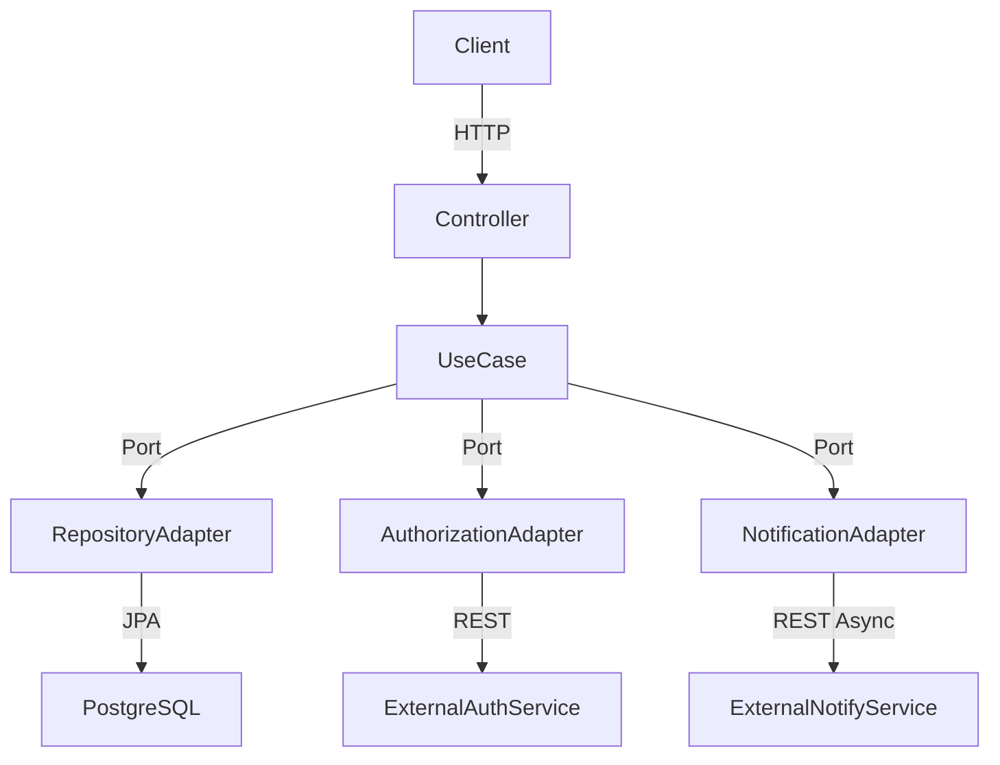

# PayFlow API

<p align="center">
  
  
  
  
  
</p>

A REST API for simplified peer-to-peer payments, inspired by the PicPay technical challenge. Allows **regular users** to transfer money to other users and merchants, with external authorization and asynchronous notifications.

---

## Table of Contents

- [About](#about)
- [Architecture](#architecture)
- [Tech Stack](#tech-stack)
- [Business Rules](#business-rules)
- [Running Locally](#running-locally)
- [Endpoints](#endpoints)
- [Interactive Docs](#interactive-docs)
- [Technical Decisions](#technical-decisions)

---

## About

PayFlow is a payments API built as a portfolio project to demonstrate backend engineering fundamentals: hexagonal architecture, automated testing (unit + integration), CI/CD, and production deployment.

The payments domain was chosen because it represents real-world engineering challenges: user type constraints, financial consistency, external service integration, and failure resilience.

---

## Architecture

The project follows **Hexagonal Architecture (Ports & Adapters)**, keeping the domain isolated from infrastructure concerns.

```
┌─────────────────────────────────────────────────────┐
│                     API Layer                        │
│           Controllers · DTOs · ExceptionHandler      │
└──────────────────────┬──────────────────────────────┘
                       │
┌──────────────────────▼──────────────────────────────┐
│                 Application Layer                    │
│            Use Cases · Port Interfaces               │
└──────────────────────┬──────────────────────────────┘
                       │
┌──────────────────────▼──────────────────────────────┐
│                  Domain Layer                        │
│          Entities · Exceptions · Business Rules      │
└─────────────────────────────────────────────────────┘
                       │
┌──────────────────────▼──────────────────────────────┐
│              Infrastructure Layer                    │
│    JPA Adapters · External Services · Config         │
└─────────────────────────────────────────────────────┘
```



**Base package:** `com.payflow`

```
com.payflow
├── domain
│   ├── model          # User, Wallet, Transaction, UserType, TransactionStatus
│   └── exception      # UserNotFoundException, InsufficientFundsException, ...
├── application
│   ├── usecase        # CreateUser, FindUser, CreateWallet, FindWallet, Transfer, FindTransaction
│   └── port/out       # UserRepositoryPort, WalletRepositoryPort, TransactionRepositoryPort,
│                      # AuthorizationPort, NotificationPort
├── infrastructure
│   ├── persistence    # JPA repositories + adapters
│   ├── external       # MockAuthorizationService, MockNotificationService
│   └── config         # AppConfig (@EnableAsync, BCrypt, RestTemplate), OpenApiConfig
└── api
    ├── controller     # UserController, WalletController, TransactionController, HealthController
    ├── dto            # Request/Response records
    └── handler        # GlobalExceptionHandler
```

---

## Tech Stack

| Technology | Version | Role |
|---|---|---|
| [Java](https://openjdk.org/) | 17 | Primary language |
| [Spring Boot](https://spring.io/projects/spring-boot) | 3.5 | Web framework + DI |
| [Spring Data JPA](https://spring.io/projects/spring-data-jpa) | — | ORM persistence |
| [PostgreSQL](https://www.postgresql.org/) | 15 | Relational database |
| [Flyway](https://flywaydb.org/) | — | Database migrations |
| [Lombok](https://projectlombok.org/) | — | Boilerplate reduction |
| [Spring Security Crypto](https://spring.io/projects/spring-security) | — | BCrypt password encoding |
| [springdoc-openapi](https://springdoc.org/) | 2.8.8 | Swagger UI / OpenAPI 3 |
| [JUnit 5 + Mockito](https://junit.org/junit5/) | — | Unit testing |
| [Testcontainers](https://testcontainers.com/) | — | Integration tests with real PostgreSQL |
| [Docker](https://www.docker.com/) | — | Containerization (multi-stage build) |
| [Railway](https://railway.app/) | — | Production hosting |
| [GitHub Actions](https://github.com/features/actions) | — | CI/CD pipeline |

---

## Business Rules

- Users of type **COMUM** (regular) can send and receive money
- Users of type **LOJISTA** (merchant) can only receive — they cannot initiate transfers
- Each user has exactly one `Wallet`
- Wallet balance can never go negative (enforced at both domain and database levels)
- Every transfer is validated by an **external authorization service** before funds are moved
- If the authorizer denies the transfer, the transaction is saved as `FAILED` and no funds are moved
- **Notifications** are sent asynchronously after a completed transfer — a notification failure does not roll back the transfer
- CPF and email must be unique per user
- Every transfer runs inside a `@Transactional` block with automatic rollback on failure

---

## Running Locally

### Prerequisites

- Java 17+
- Docker and Docker Compose
- Maven (or use the included `./mvnw` wrapper)

### 1. Clone the repository

```bash
git clone https://github.com/mh001-code/payflow-api.git
cd payflow-api
```

### 2. Start the database

```bash
docker-compose up -d
```

This starts a PostgreSQL instance on port `5432` with:
- Database: `payflow`
- Username: `payflow_user`
- Password: `payflow_pass`

### 3. Run the application

```bash
./mvnw spring-boot:run
```

The API will be available at `http://localhost:8080`.

### 4. Run the tests

```bash
# Unit tests + integration tests (Docker required for Testcontainers)
./mvnw verify
```

---

## Endpoints

### Health

| Method | Route | Description |
|---|---|---|
| `GET` | `/health` | Application health check |

### Users

| Method | Route | Description |
|---|---|---|
| `POST` | `/users` | Create a new user |
| `GET` | `/users/{id}` | Find user by ID |

**Example — create user:**
```json
POST /users
{
  "fullName": "John Doe",
  "cpf": "123.456.789-00",
  "email": "john@example.com",
  "password": "secret123",
  "userType": "COMUM"
}
```

### Wallets

| Method | Route | Description |
|---|---|---|
| `POST` | `/wallets` | Create a wallet for a user |
| `GET` | `/wallets/{id}` | Find wallet by ID |

**Example — create wallet:**
```json
POST /wallets
{
  "userId": 1,
  "initialBalance": 500.00
}
```

### Transactions

| Method | Route | Description |
|---|---|---|
| `POST` | `/transactions` | Perform a transfer |
| `GET` | `/transactions/{id}` | Find transaction by ID |
| `GET` | `/transactions/history?userId={id}` | List all transactions for a user |

**Example — transfer:**
```json
POST /transactions
{
  "payerId": 1,
  "payeeId": 2,
  "amount": 100.00
}
```

**Response:**
```json
{
  "id": 1,
  "payerId": 1,
  "payeeId": 2,
  "amount": 100.00,
  "status": "COMPLETED",
  "createdAt": "2025-01-01T12:00:00"
}
```

### HTTP Status Codes

| Status | Situation |
|---|---|
| `201 Created` | Resource successfully created |
| `200 OK` | Query successful |
| `404 Not Found` | User, wallet, or transaction not found |
| `409 Conflict` | CPF or email already registered |
| `422 Unprocessable Entity` | Insufficient funds, merchant attempting a transfer, or authorization denied |

---

## Interactive Docs

Swagger UI available in production:

**[payflow-api-production.up.railway.app/swagger-ui.html](https://payflow-api-production.up.railway.app/swagger-ui.html)**

OpenAPI JSON: `/api-docs`

---

## Technical Decisions

**`BigDecimal` for monetary values**
Floating-point types (`double`, `float`) are unsuitable for money — they accumulate rounding errors. `BigDecimal` ensures exact precision in financial operations. The database column uses `NUMERIC(19,2)`.

**`@Transactional` on TransferUseCase**
A transfer involves multiple operations: debit, credit, and persisting the transaction record. `@Transactional` guarantees atomicity — either everything succeeds or nothing is committed, protecting balance consistency against partial failures.

**Testcontainers for integration tests**
Tests that mock the database can pass even when the real SQL behavior would fail. Testcontainers spins up a real PostgreSQL container for each integration test run, ensuring that migrations, constraints, and queries behave exactly as they do in production.

**Asynchronous notifications (`@Async`)**
Post-transfer notifications run via `@Async` so they don't block the HTTP response. A notification failure only produces a log entry — it does not roll back the transfer, as they are separate responsibilities.

**Hexagonal Architecture**
Keeps the domain (pure business rules) decoupled from infrastructure (JPA, HTTP, database). Use cases depend on port interfaces, not concrete implementations — making it straightforward to swap adapters and write isolated unit tests with mocks.

---

<p align="center">
  Built by <a href="mailto:marcioincode@gmail.com">Márcio Henrique</a>
</p>
